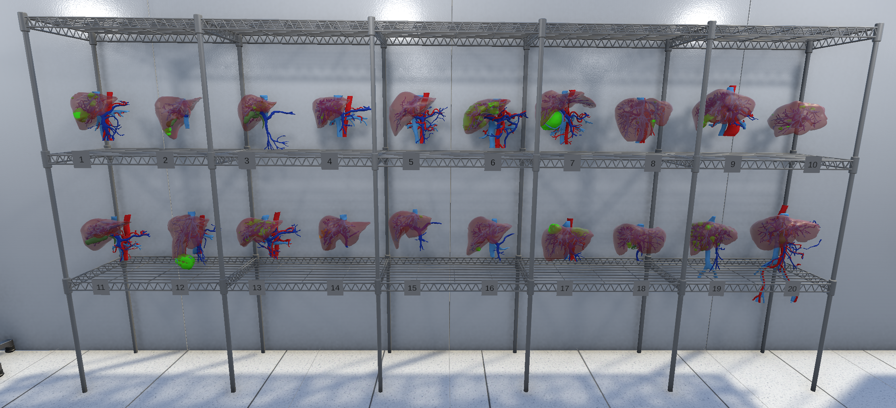
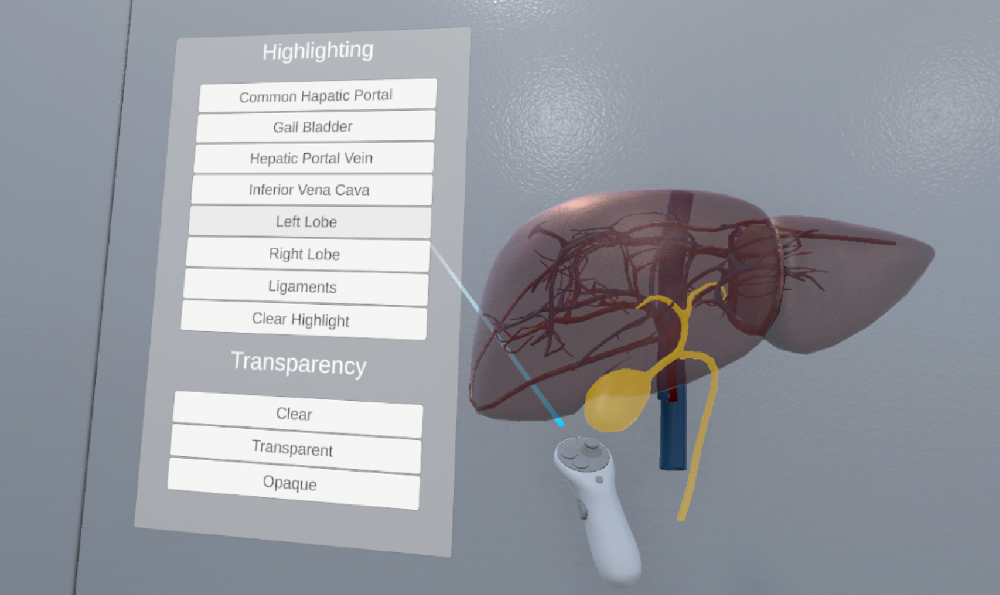
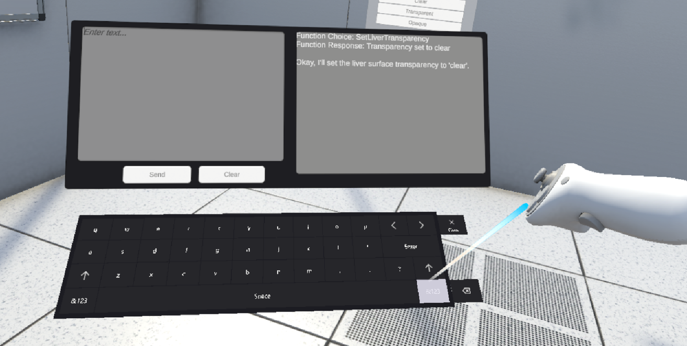
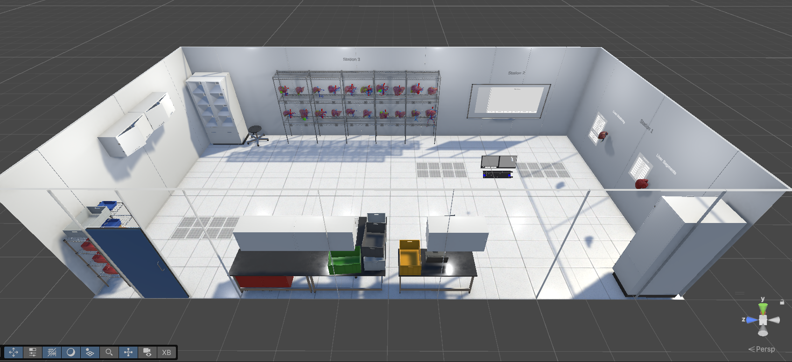

# VR Anatomy Education System with AI-Assisted Interaction

A virtual reality anatomy education app that combines traditional VR interaction with AI-assisted natural language controls. Users can explore 3D liver anatomy models, visualize patient data, and interact with the environment using either conventional VR UI or conversational commands powered by a locally hosted large language model.

---

## Overview

This project was developed as part of my Master's project at San Jose State University.

The application allows users to interact with anatomical liver models and patient information inside an immersive VR environment. In addition to traditional UI controls, the system integrates a local large language model (LLM) capable of interpreting natural language commands and executing actions within the virtual environment through a constrained function-calling framework.

A comparative user study was also conducted to evaluate AI-assisted interaction against traditional VR UI interaction.

---

## Features

- Interactive VR anatomy environment built in Unity
- 3D liver anatomy visualization
- Patient liver models from the IRCAD dataset
- AI-assisted natural language interaction
- Traditional VR UI interaction
- Local LLM integration (Gemma 3)
- Speech-to-text input
- Text-to-speech responses
- Structured JSON function calling
- Object highlighting and transparency controls
- User study comparing AI and traditional interaction methods

---

## Tools/Technologies Used

- Unity
- C#
- XR Interaction Toolkit
- LLMUnity
- Gemma 3
- Whisper (Speech-to-Text)
- Piper (Text-to-Speech)
- JSON
- Meta Quest 3
- Oculus Rift S

---

## System Architecture

The interaction pipeline consists of:

1. Speech or text input
2. Prompt construction
3. LLM processing
4. Structured JSON response
5. Function execution inside Unity
6. Visual and spoken feedback

The LLM is constrained using a predefined JSON schema to ensure reliable interaction with the virtual environment.

---

## User Study

A within subject user study was conducted comparing AI-assisted interaction with traditional VR UI interaction.

Evaluation included:

- Task completion time
- Task accuracy
- Number of interactions
- System Usability Scale (SUS)
- NASA Task Load Index (NASA-TLX)
- Igroup Presence Questionnaire (IPQ)
- Participant interviews

The study found that traditional UI interaction resulted in faster task completion, while AI-assisted interaction reduced interaction complexity and was generally perceived as usable. Many participants expressed interest in a hybrid interaction approach combining both methods.

---

## Screenshots / Demo

---

## Building and Running

This project was developed using Unity.

Because of the project's size, some assets and third-party dependencies (including certain models and datasets) are not included in this repository.

Additional setup may be required before the project can be built successfully.

---

## Future Improvements

Potential future work includes:

- Larger language models
- Improved speech recognition
- Faster inference
- More conversational interactions
- Hybrid AI/UI interaction
- Additional anatomy datasets

---
